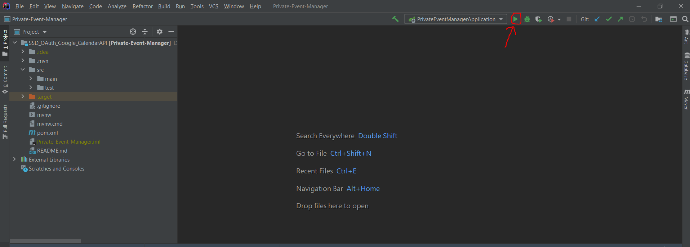
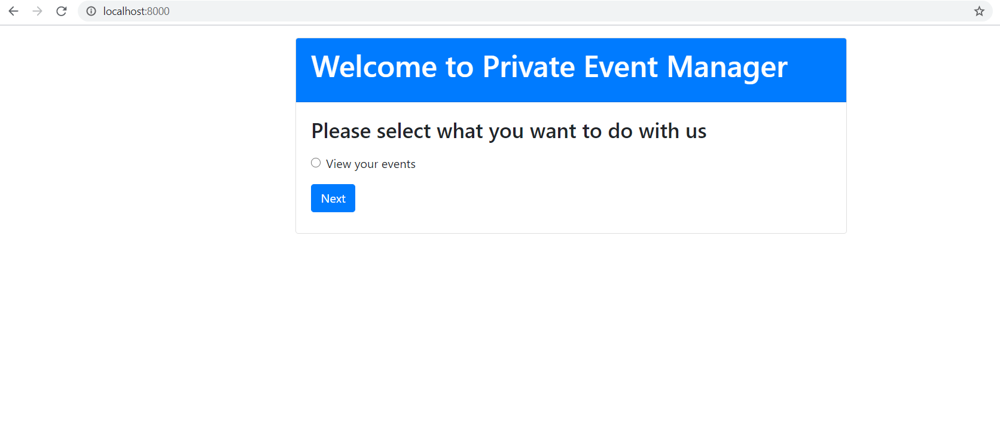

# SSD_OAuth_Google_CalendarAPI

## Introduction

This application was developed to retrieve Google Calendar events of a particular user for a given date range. For user authorization, a very well-known authorization framework called OAuth was used. 

## Technology Stack

* **Spring boot**: server-side implementation
* **IntelliJ Ultimate 2020.2**: Integrated Development Environment (IDE)
* **Google Calendar API**: the resource server API
* **OAuth 2.0**: the authorization framework

## Prerequisites

* Java version 8: [Java 8 download](https://www.oracle.com/java/technologies/javase/javase-jdk8-downloads.html)
* OS should be Windows 10
* IntelliJ Ultimate 2020.2 must be installed [download here](https://www.jetbrains.com/idea/download/#section=windows)
* Git command line tool [download here](https://git-scm.com/download/win)

## Installation

* Clone this project to a local directory
* Open the project from the IntelliJ IDE.
* Run the application by clicking on the run button as displayed below.

* Type http://localhost:8000 on your preferred web browser. the application will be displayed as follows.

## Important project files (for marking)

* ## Frontend

* **Home.html** - Display the home page
* **SelectDates.html** - Display the "Select dates" option page
* **view.html** - Display the user's calendar events

* ## Backend

* **EventController.java** - Acts as the RESTful API of the application (containes the request sent to the authorization server)
* **ModelController.java** - Contains the mappings to the frontend templates 
* **CalendarLogic.java** - Implements the logic for retrieving calendar events for the user

